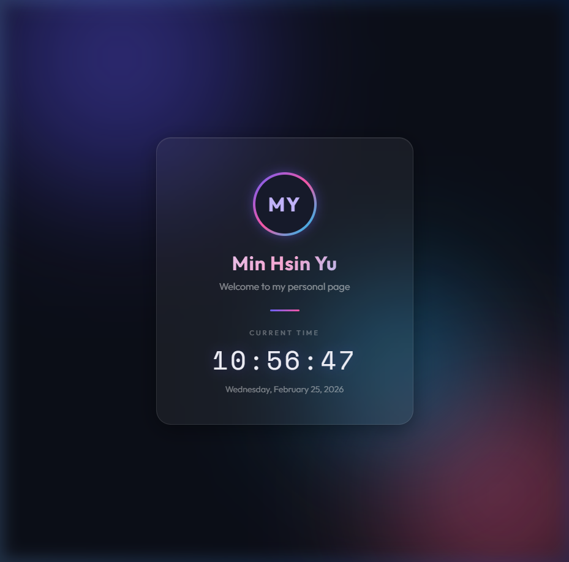

# Min Hsin Yu — Personal Page

A modern, single-page personal website featuring a glassmorphism card design with animated background orbs and a live clock.

## 🔗 Demo

👉 [https://mimimaomao11.github.io/0225DRL-HW1-PersonalPage/](https://mimimaomao11.github.io/0225DRL-HW1-PersonalPage/)

## 📸 Screenshot



## ✨ Features

- **Glassmorphism Card** — Frosted-glass effect using `backdrop-filter: blur()` with subtle border and inner glow
- **Animated Background Orbs** — Three floating gradient orbs (purple, pink, blue) that move smoothly with CSS keyframe animations
- **Live Clock** — Real-time clock updating every second, displaying both time (HH:MM:SS) and full date
- **Gradient Avatar Ring** — Initials "MY" inside a glowing, animated gradient ring
- **Gradient Text** — Name rendered with a multi-color gradient (`-webkit-background-clip: text`)
- **Entrance Animation** — Smooth fade-up effect on page load
- **Responsive Design** — Fully adapts to mobile screens via CSS media queries

## 🛠 Tech Stack

| Technology | Usage |
|------------|-------|
| HTML5 | Semantic page structure & SEO meta tags |
| CSS3 | Glassmorphism, animations, gradients, responsive layout |
| JavaScript | Live clock with `setInterval()` |
| Google Fonts | [Outfit](https://fonts.google.com/specimen/Outfit) (headings & body) / [Space Mono](https://fonts.google.com/specimen/Space+Mono) (clock) |

## 📁 Project Structure

```
L1-PersonPage/
├── index.html       # Main HTML page
├── style.css        # Styling, animations & responsive design
├── screenshot.png   # Page screenshot
├── summary.md       # Development summary
└── README.md        # This file
```

## 🚀 Getting Started

1. **Clone the repository**
   ```bash
   git clone https://github.com/mimimaomao11/0225DRL-HW1-PersonalPage.git
   ```
2. **Open in browser**
   ```bash
   cd 0225DRL-HW1-PersonalPage
   open index.html      # macOS
   start index.html     # Windows
   ```

No build tools or dependencies required — just open `index.html` in any modern browser.

## 👤 Author

- **Name**: Min Hsin Yu
- **GitHub**: [@mimimaomao11](https://github.com/mimimaomao11)
- **Email**: wawa8989@gmail.com
